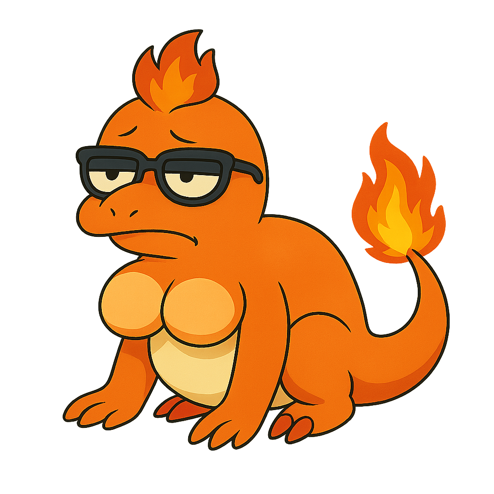
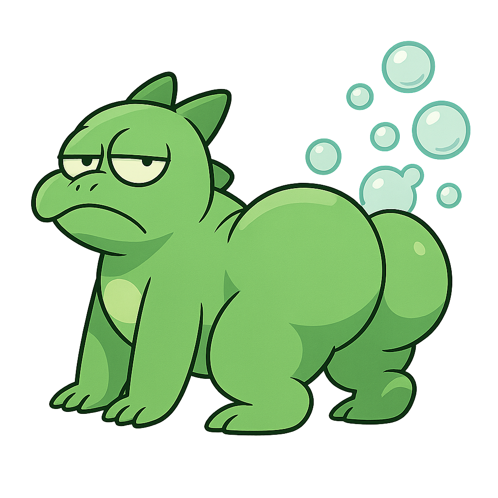

<p align="center">
  
</p>

# Shlagémon

[](https://ko-fi.com/S6S61IX3R2)

Plongez dans un univers délirant peuplé de Shlagémons totalement barrés. Capturez-les, faites-les combattre et remplissez votre Shlagedex pour devenir le dresseur ultime et rafler les précieux _Shlagidolar_. Le projet utilise les dernières versions de **Vue&nbsp;3** et suit les meilleures pratiques de la doc officielle pour une expérience fluide, que ce soit sur mobile ou sur grand écran.

<p align="center">
  
  
  
  
</p>

## Concept

Chaque Shlagémon dispose de statistiques qui lui sont propres et appartient à une poignée de types complètement improbables. Une interface minimaliste vous permet de choisir votre compagnon, de consulter le _Shlagedex_ et de lancer des combats acharnés.
Un mini-jeu de réflexion « Tic Tac Toe » permet aussi de récolter quelques Shlagidolars.

## Fonctionnalités clés

### Stack technique

- **Vue&nbsp;3 + Vite + TypeScript** pour un développement moderne et rapide.
- **Pinia** et **pinia-plugin-persistedstate** pour une gestion d'état fiable avec persistance.
- **UnoCSS** en mode _attributify_ pour un design mobile first et réactif sans feuilles de style dédiées.
- **Auto-imports** des composants, stores et composables pour un code concis.
- Routing **basé sur les fichiers** et génération statique grâce à `vite-ssg`.
- Prêt pour le **PWA** (service worker, manifest, mode hors-ligne) et l'**internationalisation** via **Vue I18n**.
- Tests unitaires (Vitest) et end‑to‑end (Cypress) intégrés.

### Gameplay et interface

- Système de combat et de capture avec gestion du _Shlagedex_ et des _Shlagidolar_.
- Thèmes **clair** et **sombre** via les classes `dark:` (ex. `dark:bg-gray-800`).
- **Carte interactive** construite avec **Leaflet** pour explorer le monde.
- Composants découpés en unités réutilisables pour une interface accessible.
- Mini-jeux : **Tic Tac Toe** (IA minimax), **Bataille navale**, **Puissance 4**, **Mastermind**, **Memory** et **Taquin**.
- Chances de capture basées sur la vie restante et le niveau de l'ennemi.
- Les œufs existent déjà dans le jeu mais ne sont pas encore obtenables.

## Installation

1. Clonez ce dépôt.
2. Installez les dépendances :
   ```bash
   pnpm install
   ```

## Utilisation

### Lancement en développement

```bash
pnpm dev
```

Ouvrez <http://localhost:3333> pour voir l'application.

### Construction pour la production

```bash
pnpm build
```

Les fichiers prêts à être servis se trouvent dans le dossier `dist`.

### Tests

- Avant de lancer les tests, exécutez `pnpm install` pour installer les dépendances.

- Tests unitaires : `pnpm test:unit`
- Tests end‑to‑end : `pnpm test:e2e`

Depuis le jeu, rendez-vous au village **Sux-Mais-Bouls** et cliquez sur « Mini-jeu » pour lancer une partie de Tic Tac Toe.

- Supprimer une sauvegarde vide le stockage local puis recharge automatiquement l'application.

### Générer le fichier d'évolutions

Ce script parcourt les données de chaque Shlagémon pour générer un tableau ordonné par niveau. Le fichier `evolutions.csv` indique la tranche de niveau à laquelle on rencontre chaque monstre et, s'il existe, son niveau d'évolution.

```bash
pnpm evolutions:csv
```

Le fichier est ensuite disponible à la racine du projet.

## Structure du projet

```
├─ public/            # ressources statiques (images, icônes...)
├─ src/
│  ├─ components/     # petits composants réutilisables
│  ├─ layouts/        # structures de pages
│  ├─ pages/          # routage automatique
│  ├─ stores/         # Pinia
│  └─ ...
└─ uno.config.ts      # configuration d'UnoCSS
```

Le style par défaut vise les écrans mobiles. Les variantes `sm:`, `md:`, `lg:` etc. ajustent l'affichage pour les résolutions supérieures. Pour des besoins spécifiques, on peut ajouter du CSS interne aux composants.

## Contribution

Les contributions sont les bienvenues ! N'hésitez pas à ouvrir une _issue_ ou une _pull request_ pour signaler un bug ou proposer une amélioration.

## Licence

Ce projet est distribué sous licence [MIT](LICENSE).
